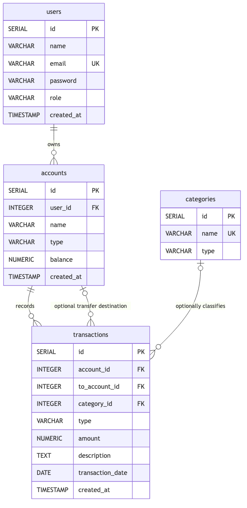

# FinTrack API

FinTrack API adalah backend untuk aplikasi pencatatan keuangan pribadi. Setiap pengguna dapat memiliki beberapa akun, seperti uang tunai, rekening bank, atau dompet digital. Pengguna mencatat pemasukan, pengeluaran, dan transfer pada akun tersebut, lalu mengelompokkannya dengan kategori agar arus kas dan pola pengeluaran lebih mudah dianalisis.

Source code project ada di folder [`fintrack-api/`](fintrack-api).

## Live Base URL

[https://milestone-4-ai-novanx-production.up.railway.app](https://milestone-4-ai-novanx-production.up.railway.app)

Dokumentasi Swagger tersedia di [https://milestone-4-ai-novanx-production.up.railway.app/docs](https://milestone-4-ai-novanx-production.up.railway.app/docs).

## What's New (Week 21)

- Dokumentasi API interaktif dengan **Swagger/OpenAPI** (`@nestjs/swagger`), tersedia di `/docs`
- Seluruh controller (`accounts`, `categories`, `transactions`, `users`) dilengkapi `@ApiTags`, `@ApiOperation`, `@ApiParam`, dan dekorator response (`@ApiOkResponse`, `@ApiCreatedResponse`, `@ApiNoContentResponse`, `@ApiNotFoundResponse`, `@ApiBadRequestResponse`)
- Seluruh DTO (`CreateXxxDto`) dilengkapi `@ApiProperty`/`@ApiPropertyOptional` dengan deskripsi dan contoh nilai; `UpdateXxxDto` memakai `PartialType` dari `@nestjs/swagger` agar skema optional-nya terbawa ke dokumentasi

## What's New (Week 20)

Minggu lalu hanya tersedia 4 mock `GET` endpoint tanpa validasi. Minggu ini:

- Full CRUD (`GET`, `GET /:id`, `POST`, `PATCH`, `DELETE`) untuk `accounts`, `categories`, dan `transactions`; `users` mendapat `POST` (registrasi)
- Global `ValidationPipe` dengan `whitelist`, `forbidNonWhitelisted`, dan `transform`
- DTO per resource per operasi (`CreateXxxDto`, `UpdateXxxDto` via `PartialType`)
- Balance-update logic di service layer: `income` menambah, `expense` mengurangi saldo akun; `PATCH` dan `DELETE` otomatis reverse efek lama
- Enum `TransactionType` dipakai konsisten di DTO, interface, dan service
- Schema `transactions.category_id` dibuat nullable dengan CHECK constraint untuk tipe `transfer`
- Data seed dan mock service disinkronkan: 5 users, 6 accounts, 7 categories
- `tsconfig.json` dibersihkan dari opsi deprecated

## Entity-Relationship Diagram



Source diagram tersedia di [`fintrack-api/docs/erd.mmd`](fintrack-api/docs/erd.mmd) agar ERD dapat diperbarui bersama schema.

## Requirements

- Node.js 20 atau versi yang lebih baru
- npm
- PostgreSQL

## Menjalankan NestJS

Jalankan perintah berikut dari root repo:

```bash
cd fintrack-api
npm install
cp .env.example .env
npm run start:dev
```

Server berjalan di `http://localhost:3000` secara default. Nilai port dapat diubah melalui `PORT` di file `.env`.

## API Documentation (Swagger)

Setelah server berjalan, dokumentasi API interaktif (Swagger UI) tersedia di:

```
http://localhost:3000/docs
```

Dokumentasi ini dihasilkan otomatis dari kode (`DocumentBuilder` + `SwaggerModule` di `fintrack-api/src/main.ts`) dan mencakup seluruh endpoint `users`, `accounts`, `categories`, dan `transactions`, lengkap dengan skema request/response, contoh nilai, dan status code (`200`, `201`, `204`, `400`, `404`) untuk tiap operasi.

## API Endpoints

### Users

| Method | Endpoint | Deskripsi            |
| ------ | -------- | -------------------- |
| GET    | `/users` | Daftar semua user    |
| POST   | `/users` | Registrasi user baru |

### Accounts

| Method | Endpoint        | Deskripsi         |
| ------ | --------------- | ----------------- |
| GET    | `/accounts`     | Daftar semua akun |
| GET    | `/accounts/:id` | Detail akun       |
| POST   | `/accounts`     | Buat akun baru    |
| PATCH  | `/accounts/:id` | Update akun       |
| DELETE | `/accounts/:id` | Hapus akun        |

### Categories

| Method | Endpoint          | Deskripsi             |
| ------ | ----------------- | --------------------- |
| GET    | `/categories`     | Daftar semua kategori |
| GET    | `/categories/:id` | Detail kategori       |
| POST   | `/categories`     | Buat kategori baru    |
| PATCH  | `/categories/:id` | Update kategori       |
| DELETE | `/categories/:id` | Hapus kategori        |

### Transactions

| Method | Endpoint            | Deskripsi              |
| ------ | ------------------- | ---------------------- |
| GET    | `/transactions`     | Daftar semua transaksi |
| GET    | `/transactions/:id` | Detail transaksi       |
| POST   | `/transactions`     | Buat transaksi baru    |
| PATCH  | `/transactions/:id` | Update transaksi       |
| DELETE | `/transactions/:id` | Hapus transaksi        |

### Contoh Request Body

**POST /users**

```json
{ "name": "Alya Putri", "email": "alya@example.com", "password": "secret123" }
```

**POST /accounts**

```json
{ "user_id": 1, "name": "BCA Utama", "type": "bank", "balance": 5000000 }
```

**POST /categories**

```json
{ "name": "Salary", "type": "income" }
```

**POST /transactions**

```json
{
  "account_id": 1,
  "category_id": 1,
  "type": "income",
  "amount": 9000000,
  "description": "June salary",
  "transaction_date": "2026-06-01"
}
```

**POST /transactions (transfer antar akun sendiri)**

```json
{
  "account_id": 1,
  "to_account_id": 2,
  "type": "transfer",
  "amount": 500000,
  "description": "Top up dompet harian",
  "transaction_date": "2026-06-15"
}
```

> `type` transactions: `income` | `expense` | `transfer`
> `type` categories: `income` | `expense`
> Untuk `type: "transfer"`, `category_id` tidak wajib diisi, tetapi `to_account_id` **wajib** diisi.
> Transfer hanya diperbolehkan **antar akun milik user yang sama**; `to_account_id` harus berbeda dari `account_id` dan harus dimiliki oleh `user_id` yang sama dengan akun asal. Transfer ke akun milik user lain (atau tanpa `to_account_id`) ditolak dengan **400 Bad Request**.

## Validasi

Global `ValidationPipe` aktif dengan:

- `whitelist: true` — field yang tidak ada di DTO otomatis dihapus
- `forbidNonWhitelisted: true` — field asing mengembalikan **400 Bad Request**
- `transform: true` — tipe data otomatis dikonversi (string → number untuk `:id`)

## Database & Prisma

Skema database dikelola lewat **Prisma** (`fintrack-api/prisma/schema.prisma`), strukturnya identik dengan `fintrack-api/db/schema.sql` (tabel & kolom snake_case yang sama). Semua service (`users`, `accounts`, `categories`, `transactions`) mengakses PostgreSQL lewat `PrismaService`.

Setup dari folder `fintrack-api`:

```bash
cd fintrack-api
cp .env.example .env          # sesuaikan DATABASE_URL dengan kredensial Postgres lokal
createdb fintrack             # atau: createdb -U <role> fintrack
npx prisma migrate dev --name init   # membuat tabel sesuai prisma/schema.prisma + auto-seed
```

Jika PostgreSQL meminta password role tertentu, sesuaikan `DATABASE_URL` di `.env`:

```
DATABASE_URL=postgresql://<user>:<password>@localhost:5432/fintrack
```

Data contoh (`fintrack-api/prisma/seed.ts`, 5 users, 6 accounts, 7 categories, 24 transactions — identik dengan `fintrack-api/db/seed.sql`) otomatis dijalankan setiap kali `prisma migrate dev` atau `prisma migrate reset` selesai, lewat konfigurasi `"prisma": { "seed": "..." }` di `package.json`. Untuk menjalankannya ulang secara manual (misalnya setelah data berubah saat testing):

```bash
npx prisma db seed
# atau
npm run prisma:seed
```

Perintah lain yang tersedia:

```bash
npm run prisma:generate   # regenerate Prisma Client setelah schema.prisma berubah
npm run prisma:migrate    # buat/terapkan migrasi baru (otomatis re-seed)
npm run prisma:studio     # buka Prisma Studio (GUI) untuk melihat/edit data
npm run prisma:seed       # jalankan ulang prisma/seed.ts secara manual
```

> `fintrack-api/db/schema.sql`, `fintrack-api/db/seed.sql`, dan `fintrack-api/db/queries.sql` tetap disimpan sebagai referensi/dokumentasi skema mentah, tetapi migrasi dan seeding yang sesungguhnya sekarang dijalankan lewat Prisma (`fintrack-api/prisma/migrations/`, `fintrack-api/prisma/seed.ts`).

### Query relasional (nested include)

Beberapa endpoint mengembalikan data relasi bersarang dalam satu response (Prisma `include`), bukan sekadar `findMany`/`findUnique` datar:

- `GET /users` → setiap user disertai `accounts` miliknya (password selalu disembunyikan lewat `omit`)
- `GET /accounts/:id` → akun disertai seluruh `transactions` miliknya
- `GET /transactions` dan `GET /transactions/:id` → transaksi disertai `account`, `toAccount` (tujuan transfer, jika ada), dan `category`

## Pengujian

Dari folder `fintrack-api`:

```bash
npm run build
npm run lint
npm run test
npm run test:e2e
```

Tes e2e memeriksa bahwa endpoint dapat diakses dan mengembalikan field sesuai canonical schema FinTrack.

## Postman Collection

Collection Postman tersedia di [fintrack-api/docs/fintrack.postman_collection.json](https://github.com/Revou-FSSE-Feb26/milestone-4-AI-NovaNX/blob/main/fintrack-api/docs/fintrack.postman_collection.json) (klik untuk melihat isi file di GitHub, lalu download dan import ke Postman lewat `File → Import`). Atur variable `baseUrl` (default `http://localhost:3000`), lalu jalankan. Collection ini mencakup:

- Request CRUD untuk `users`, `accounts`, `categories`, dan `transactions`
- Contoh transfer antar akun sendiri (happy path) dan transfer lintas user (ditolak 400)
- Minimal satu contoh **validation error (400)** per resource, lengkap dengan saved response example
